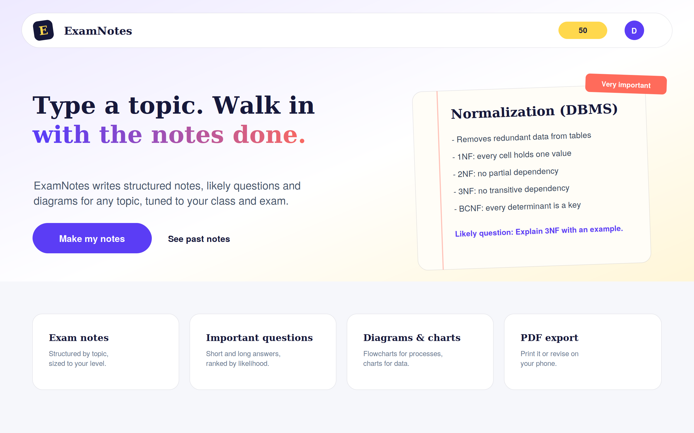
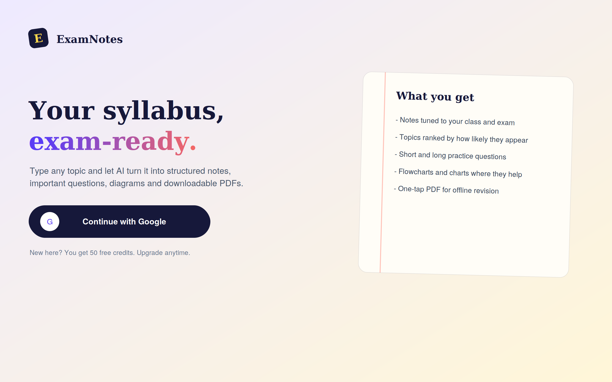
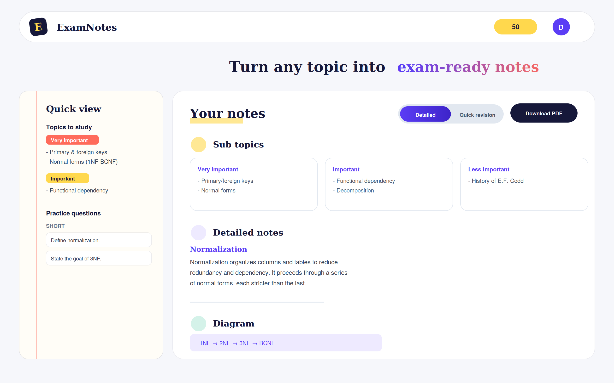
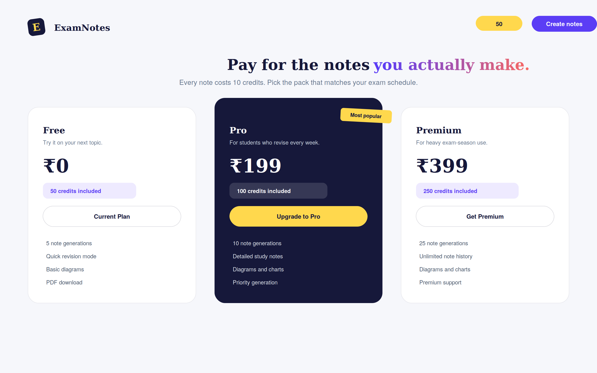

<p align="center">
  
</p>

<p align="center">
  AI-powered exam preparation platform. Enter a topic, class level and exam type, and get back
  structured notes, ranked important topics, short/long/diagram questions, an optional Mermaid
  diagram, optional charts, and a one-click PDF export — all generated by Gemini.
</p>

<p align="center">
  <a href="https://github.com/DheerajDev-leper/AI-Exam-Notes-Generator">github.com/DheerajDev-leper/AI-Exam-Notes-Generator</a>
</p>

---

## Screenshots

| Home | Sign in |
|---|---|
|  |  |

| Generated notes | Pricing |
|---|---|
|  |  |

> These are design previews built from the app's own styles, not live captures — your actual generated notes will reflect real AI output.

---

## Features

- **Google sign-in** via Firebase Auth, verified server-side with an ID token (no client-trusted user data).
- **AI note generation** — structured Markdown notes, topic importance ranking, revision-mode summaries, practice questions, and optional diagrams/charts, all returned as strict JSON from Gemini.
- **Credit system** — new users get 50 free credits; each generation costs 10, deducted atomically and refunded automatically if generation fails.
- **History** — every generated note is saved and browsable later.
- **PDF export** — download any generated note as a formatted PDF.
- **Pricing page** — Free / Pro / Premium credit packs (UI only; no payment gateway wired up).

## Tech Stack

**Frontend**
- React 18 + Vite
- React Router v6
- Redux Toolkit
- Tailwind CSS v4
- Motion (Framer Motion) for animation
- Axios, React Markdown, Mermaid, Recharts
- Firebase Auth (Google provider)

**Backend**
- Node.js + Express
- MongoDB + Mongoose
- Firebase Admin SDK (ID token verification)
- JSON Web Tokens (session cookie)
- Google Gemini API (`generateContent`, JSON mode)
- PDFKit (PDF generation)

## Project Structure

```
.
├── client/                  # Frontend (React + Vite)
│   └── src/
│       ├── components/      # Navbar, Footer, TopicForm, Finalresult, Sidebar, Chart, Mermaid, PageTransition
│       ├── pages/            # Home, Auth, Notes, History, Pricing
│       ├── redux/            # store.js, userSlice.js
│       ├── services/         # api.js (axios calls to the backend)
│       ├── utils/             # firebase.js
│       ├── config.js         # serverUrl (reads VITE_SERVER_URL)
│       ├── App.jsx
│       ├── main.jsx
│       └── index.css
│
└── server/                 # Backend (Express)
    ├── controllers/          # auth, user, notes, generate, pdf
    ├── models/                # user.model.js, notes.model.js
    ├── routes/                # auth, user, generate, pdf
    ├── middleware/            # isAuth.js
    ├── services/              # gemini.services.js
    ├── utils/                 # connectdb.js, prompt.js, token.js
    ├── index.js
    └── .env.example
```

## Prerequisites

- Node.js 18+
- A MongoDB database (local or Atlas)
- A Firebase project with Google sign-in enabled
- A Google Gemini API key

## Getting Started

### 1. Clone and install

```bash
git clone https://github.com/DheerajDev-leper/AI-Exam-Notes-Generator.git
cd AI-Exam-Notes-Generator

# Frontend
cd client
npm install
cd ..

# Backend
cd server
npm install firebase-admin express mongoose jsonwebtoken cookie-parser cors dotenv pdfkit
cd ..
```

> The frontend's `package.json` should already include `react`, `react-router-dom`, `@reduxjs/toolkit`, `react-redux`, `axios`, `motion`, `react-markdown`, `mermaid`, `recharts`, `react-icons`, `firebase`, and `tailwindcss`. Install any that are missing with `npm install <package>` inside `client/`.

### 2. Configure environment variables

**Frontend — `client/.env`:**

```env
VITE_SERVER_URL=http://localhost:8000
VITE_FIREBASE_API_KEY=
VITE_FIREBASE_AUTH_DOMAIN=
VITE_FIREBASE_PROJECT_ID=
VITE_FIREBASE_STORAGE_BUCKET=
VITE_FIREBASE_MESSAGING_SENDER_ID=
VITE_FIREBASE_APP_ID=
```

**Backend — `server/.env`:**

```env
PORT=8000
CLIENT_URL=http://localhost:5173
MONGODB_URL=
JWT_SECRET=
GEMINI_API_KEY=
GEMINI_MODEL=gemini-3.5-flash-lite
FIREBASE_PROJECT_ID=
```

`FIREBASE_PROJECT_ID` must match `VITE_FIREBASE_PROJECT_ID` — it's used to verify the Google ID token server-side. Leave `CLIENT_URL` unset in local development and the server will accept any `http://localhost:<port>` origin automatically (useful since Vite may start on 5173, 5174, etc.).

### 3. Run it

```bash
# Terminal 1 — backend
cd server
npm run dev   # or: node index.js

# Terminal 2 — frontend
cd client
npm run dev
```

The app runs at `http://localhost:5173` (or whichever port Vite chooses) and talks to the API at `http://localhost:8000`.

## How It Works

1. The user signs in with Google. The frontend sends Firebase's ID token to `/api/auth/signup`; the server verifies it with Firebase Admin, creates or finds the user, and sets an `httpOnly` JWT cookie.
2. On `/notes`, the user fills in a topic (and optionally class level, exam type, revision mode, diagrams, charts) and submits.
3. The backend deducts 10 credits, builds a strict JSON-output prompt (`utils/prompt.js`), and calls Gemini.
4. Gemini's response is parsed, normalized to a guaranteed shape, saved to MongoDB, and returned to the frontend for display.
5. If generation fails, the 10 credits are refunded automatically.
6. Generated notes can be downloaded as a PDF or revisited later from `/history`.

## Known Limitations

- The Pricing page is UI only — no payment gateway is integrated.
- PDF export does not bundle a font, so non-Latin scripts (e.g. Hindi) won't render correctly in the downloaded PDF.
- No automated tests are included yet.
